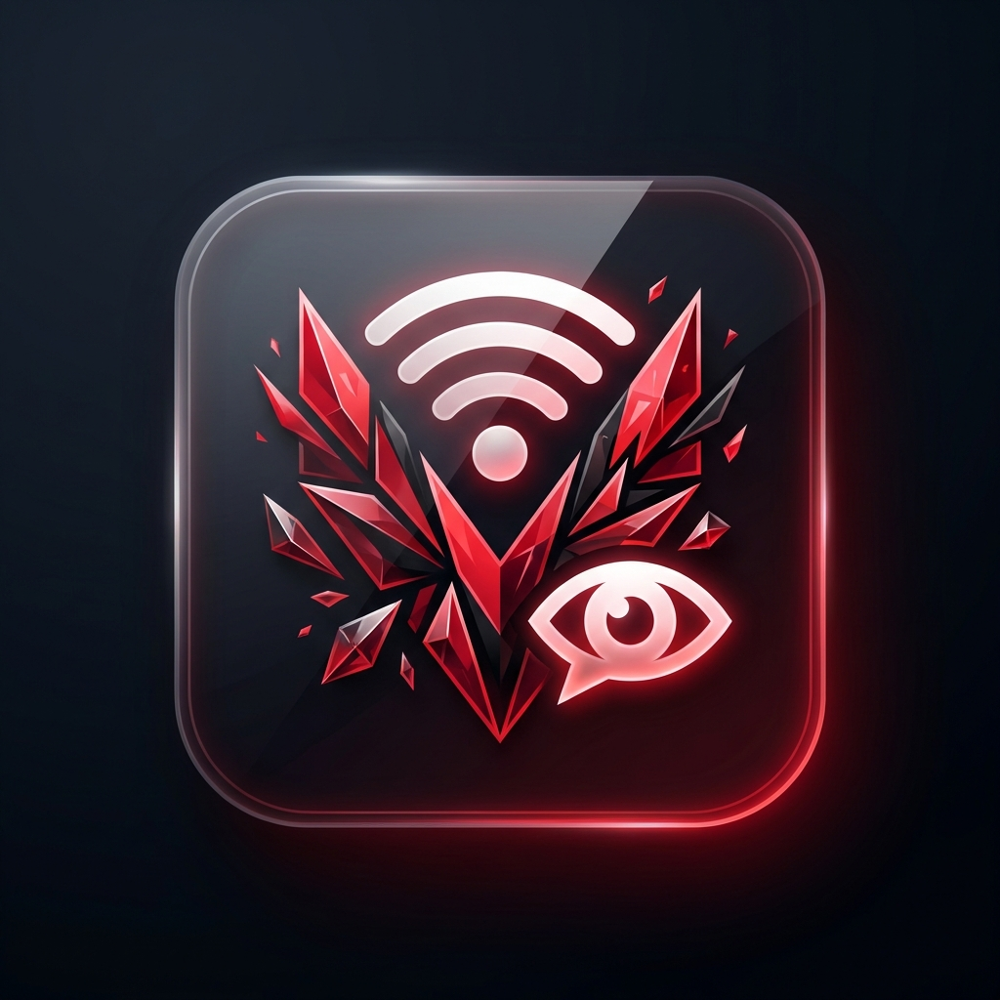

<div align="center">
  
  <h1>ValorantRPC</h1>
  <p>
    <strong>The Ultimate Discord Rich Presence Client for Valorant</strong>
  </p>
  
  
  
  
  

  <br />
</div>

**ValorantRPC** is a high-performance, fully automated Rich Presence client that seamlessly integrates your Valorant session with Discord. Built for speed and reliability, it provides real-time, detailed statistics to your friends and community without performance overhead.

## Features
- 🎮 **Live Game Integration**: Instantly updates your status with your current Map, Agent, and Score.
- 🎯 **Advanced Tracking**: Displays detailed match info including game mode and party size.
- ⚡ **Auto-Launch**: Can automatically launch Valorant if it's not already running.
- 🌐 **Localization**: Native support for multiple languages including Polish.
- 🛠 **System Tray**: Runs silently in the background with a minimal footprint.

## Status (v3)
This project is a heavily modernized fork of the original implementation, featuring a rewritten core for stability and new API integrations.

- [x] **Core Presence**: Map, Agent, Score, and Mode detection.
- [x] **Queue Timer**: Accurate matchmaking wait time display.
- [x] **Party System**: Displays party size and status (Open/Closed).
- [ ] **Skin Showcase**: (Coming Soon) Display your equipped Vandal/Phantom skin.
- [ ] **Ask to Join**: (Coming Soon) Direct "Ask to Join" button integration for Discord parties.

## Installation
1. Download the latest release.
2. Install dependencies:
   ```bash
   pip install -r requirements.txt
   ```
3. Run the client:
   ```bash
   python main.py
   ```

## 🛠 Tech Stack
- **Core**: Python 3.11+
- **API**: Riot Client Local API (Locklife/RiotClientInstalls)
- **Presence**: pypresence

## ⚠️ Disclaimer
This project is not affiliated with Riot Games. Riot Games does not endorse or sponsor this project.

## 📄 License
Distributed under the MIT License.

