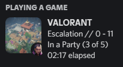
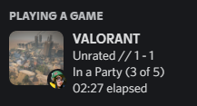

# 🌌 VALORANT Discord Rich Presence

```
 _   _____   __   ____  ___  ___   _  ________                
| | / / _ | / /  / __ \/ _ \/ _ | / |/ /_  __/__________  ____
| |/ / __ |/ /__/ /_/ / , _/ __ |/    / / / /___/ __/ _ \/ __/
|___/_/ |_/____/\____/_/|_/_/ |_/_/|_/ /_/     /_/ / .__/\__/ 
                                                    /_/         
```

> **🔧 This is the official premium maintained version of [valorant-rpc](https://github.com/baeowsky/valorant-rpc) with a brand-new desktop visual interface.**  
> Built with React + TypeScript + Tailwind CSS v4 on the frontend, and Python + Flask + PyInstaller on the backend. Runs quietly in your system tray and features a state-of-the-art configuration panel.

---

## 🌟 Features & Premium Visuals

*   🖥️ **Premium Glassmorphic Dashboard**: A fully overhauled desktop configuration window featuring obsidian-black cards, lavender-indigo glows, and an elegant procedural SVG film grain overlay.
*   🎭 **Live Discord Card Preview**: See your profile card exactly how it appears on Discord in real-time. It dynamically loads your **real Discord avatar, username, and banner** using tokenless local IPC socket handshakes!
*   🔌 **Global RPC Active Toggle**: A prominent toggle on the sidebar to instantly turn your Rich Presence on or off. Toggling it off immediately clears your playing status from Discord.
*   🎮 **Real-Time Presence Tracking**: Seamlessly tracks whether you are in the menu, queueing, in the shooting range, or in-game, showing your active agent, map, party sizes, and live scores.
*   🔄 **Autosave Engine**: Every configuration adjustment (ranks, small images, presence timeouts) is autosaved instantly to your local profile.
*   🚀 **One-Click Restart**: Restart the background RPC connection loop instantly from the sidebar dashboard.
*   📜 **Integrated Log Console**: Read live logs from `rpc.log` in real-time to monitor connection states. Fully optimized scroll mechanics that never jump or scroll your main dashboard.
*   💜 **Support**: Quick access to join the **[Official Support Discord](https://discord.gg/RJjMucjhbj)** directly from the sidebar.

---

## 📸 Interface Preview

*(Interteractive custom UI mockups matching modern premium desktop applications)*



---

## 💾 Installation & Setup

We compiled the entire application into a single standalone Windows setup wizard! No Python, Node.js, or complex setups are required for end-users.

1.  Go to the **[Releases](https://github.com/baeowsky/valorant-rpc/releases)** page.
2.  Download the latest `valorant-rpc-setup.exe`.
3.  Launch the installer, select your target folder (defaults to `%LOCALAPPDATA%/Valorant-RPC`), and click **Install Now**.
4.  Launch the application! The icon will appear in your system tray and the beautiful configuration dashboard will open automatically.

### 🗑️ Uninstallation
To completely uninstall Valorant RPC, just open **Add or Remove Programs** in Windows settings, find **Valorant RPC**, and click **Uninstall**. Alternatively, run `uninstall.bat` inside the installation folder.

---

## 🛠️ Development & Compilation

If you want to modify or compile the application yourself:

### 1. Requirements
*   Python 3.10+
*   Node.js 18+

### 2. Frontend Development (`web-ui/`)
```bash
cd web-ui
npm install
npm run dev     # Run Vite local dev server
npm run build   # Compile production assets directly into Flask static assets folder
```

### 3. Backend Development & Run
```bash
pip install -r requirements.txt
python main.py
```

### 4. Compiling Executables
We use PyInstaller to compile both the silent background app and the setup wizard:

```bash
# 1. Compile background console-less app
python -m PyInstaller valorant-rpc.spec --clean --noconfirm

# 2. Compile standalone desktop setup installer (embeds the compiled app)
python -m PyInstaller --onefile --noconsole --name "valorant-rpc-setup" --add-data "dist/valorant-rpc.exe;." installer.py
```

---

## 🤝 Support
Need help or want to suggest features? Join the **[Official Support Discord Server](https://discord.gg/RJjMucjhbj)**!

---

## ⚖️ Disclaimer

This project is not affiliated with Riot Games or any of its employees and therefore does not reflect the views of said parties. Riot Games does not endorse or sponsor this project. Riot Games, and all associated properties are trademarks or registered trademarks of Riot Games, Inc.

---

## 📄 License

This project is licensed under the MIT License - see the [LICENSE.txt](LICENSE.txt) file for details.
